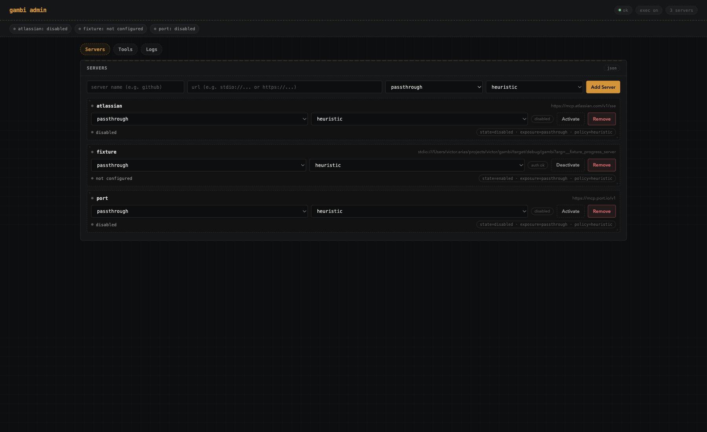
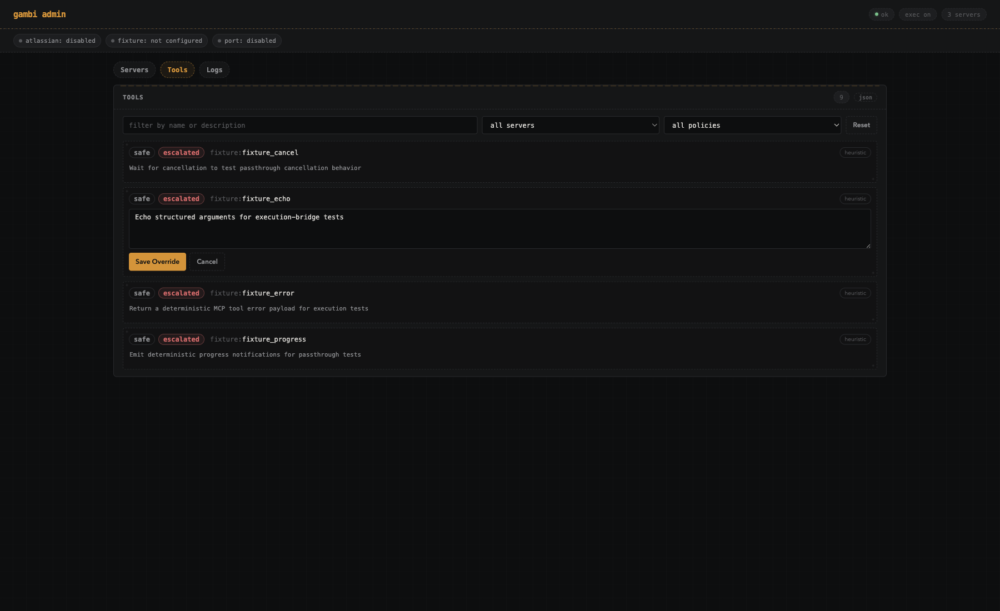

One MCP endpoint. All your servers. Code that calls them.

A local MCP aggregator that gives your coding agent a single stdio connection to every upstream MCP server you use, plus a built-in execution tool that can call any of them from Python scripts — so the agent stops round-tripping one tool at a time.

- **Automatic OAuth token refresh** — gambi handles PKCE, token refresh, rotation, and degraded-state recovery in the background. Agents never stall waiting for expired tokens.
- **Python execution sandbox** — agents write short Python scripts that compose multiple tool calls in one shot, drastically reducing round-trips and token usage.
- **Single MCP connection** — one stdio endpoint aggregates all your upstream servers with namespacing, exposure controls, and execution policy.



## Why this exists

I tried to use an existing MCP hub. I couldn't get it to work. The documentation looked extensive but didn't actually help. My coding agents couldn't figure it out either — they just kept telling me to add more dependencies. The usability to get it running was so painful that I thought: *I can't use this. Even if I fix it, I can't use this.*

At the same time, I'd been thinking about a different problem. MCP is great — small scripts, API calls, structured tool access. But the more servers you add to a hub, the more tools your agent sees, and agents get lost in a sea of dozens of tools. Worse, they call them one by one, round-tripping for every little step of a workflow.

So what if we solve both problems at once? A single aggregator that *just works* — one binary, zero config ceremony — **and** an execution tool that lets the agent write a short Python script to orchestrate multiple tool calls in one shot.

That kind of duct-tape-and-ingenuity solution has a name in Brazilian Portuguese: **gambiarra**. Hence, gambi.

## What it does

- **Single MCP connection** — your agent talks to one stdio server and gets a stable gambi surface (`gambi_help`, `gambi_execute`, etc.)
- **Aggregation** — tools, prompts, and resources from every upstream server, with automatic namespacing and routing
- **`gambi_execute` + `gambi_execute_escalated`** — safe-first execution with explicit escalation when workflows need higher-risk tools
- **Admin UI** — web dashboard with four tabs (Servers, Tools, Effective, Logs) plus a status strip of per-server health chips; add/remove servers, activate/deactivate them, change exposure and policy via inline selectors, edit tool descriptions, and monitor logs
- **Activation controls** — deactivate a server without deleting config; reactivate with one click
- **Tool activation controls** — per-server tool default (`all` or `none`) plus per-tool active/inactive toggles
- **Exposure modes** — control how much tool metadata your agent sees: `passthrough`, `compact`, `names-only`, or `server-only`
- **Execution policy controls** — classify each server catalog as `heuristic`, `all-safe`, `all-escalated`, or `custom`; each tool shows a `safe`/`escalated` badge and a policy-source pill (`heuristic`, `override`, `system`)
- **OAuth handling** — PKCE, token refresh/rotation, degraded-state reporting — all managed for you
- **Tool description overrides** — click any tool description to edit it inline; save or cancel, compare diffs, or restore the original
- **Server instruction overrides** — surface upstream MCP `instructions` in `gambi_help`/admin, override them inline, and restore upstream defaults anytime
  - Override values are validated and capped at 8192 characters



## Install

Build from source:

```bash
git clone git@github.com:victorarias/gambi.git
cd gambi
cargo build --release
# binary: target/release/gambi
```

Or install directly:

```bash
cargo install --git https://github.com/victorarias/gambi.git
```

Prerequisites: Rust stable toolchain.

## Quick start

### 1. Point your coding agent to gambi

Add this to your MCP client config (Claude Code, Cursor, etc.):

```json
{
  "gambi": {
    "command": "gambi",
    "args": ["serve"]
  }
}
```

That's it. gambi starts automatically when your agent connects.

The admin UI will be at `http://127.0.0.1:3333` by default.

### 2. Add servers

Via CLI:

```bash
gambi add github https://github.com/github/github-mcp-server
gambi add my-tool 'stdio:///usr/local/bin/my-mcp?arg=--stdio'
gambi disable github
gambi enable github
gambi list
gambi remove github
```

Or through the admin UI at `http://127.0.0.1:3333`.

### 3. Use it

Your agent uses gambi's execute-first flow:
- `gambi_help` to inspect available upstream tools
- `gambi_execute` for safe workflows
- `gambi_execute_escalated` only when escalation is required

For multi-step workflows, the agent can use `gambi_execute` (safe mode) to write a Python script that calls multiple tools in sequence:

```python
issues = github.search_issues(query="bug label:critical")
for issue in issues:
    slack.post_message(channel="alerts", text=f"Critical: {issue['title']}")
```

One tool call instead of N+1 round-trips.

## Safe/ Escalated Execution Policy (What, Why, How)

**What**

- `gambi_execute` is the safe execution path.
- `gambi_execute_escalated` is the escalated execution path.
- Every upstream tool gets an effective policy level: `safe` or `escalated`.

**Why**

- You can pre-approve low-risk workflows while still allowing privileged operations.
- Agents get a deterministic escalation signal (`ESCALATION_REQUIRED`) instead of guessing.
- Dynamic MCP catalogs stay manageable as tools appear/disappear.

**How**

- Catalog policy mode can be set to `heuristic`, `all-safe`, `all-escalated`, or `custom`.
- In `custom`, set per-tool overrides (`safe`/`escalated`) for that catalog.
- Default heuristic marks a tool as `safe` when:
  - tool name starts with `get`, `list`, `search`, `lookup`, or `fetch` (case-insensitive), or
  - description starts with `get` (case-insensitive).
- If `gambi_execute` hits an escalated tool, it fails fast with `ESCALATION_REQUIRED`; rerun via `gambi_execute_escalated`.

## Execution Tools

Both execution tools let your agent write Python scripts that call upstream tools using dot syntax:

```python
# <server>.<tool>(**kwargs)
result = github.get_issue(issue_id="123")
slack.post_message(channel="eng", text=f"Issue loaded: {result['id']}")
```

- Calls are namespaced: `server.tool(**kwargs)`
- Keyword arguments only (positional args are rejected)
- `read_file(path)` is built in for UTF-8 text file input from `/tmp` only (no imports required)
- Upstream errors (`is_error=true`) fail the execution
- Progress tokens are forwarded through nested calls
- Runs on the [Monty](https://github.com/pydantic/monty) Python runtime with resource limits (not a sandbox)
- `gambi_execute` enforces safe policy
- `gambi_execute_escalated` bypasses safe-policy blocking (still subject to runtime limits)

## Admin UI

The admin panel runs on loopback only (`http://127.0.0.1:3333`) and is organized into four tabs:

**Header** — status badges (ok/error, exec on/off, server count, failure count) always visible at the top.

**Status strip** — a row of per-server chips showing connection state at a glance (authenticated, disabled, degraded, not configured). Login/refresh buttons appear inline when a server needs attention.

**Servers tab** — add servers by name + URL with exposure, policy, and tool-default selectors. Each server card shows:
- Inline dropdowns to change exposure mode (`passthrough`, `compact`, `names-only`, `server-only`), policy mode (`heuristic`, `all-safe`, `all-escalated`, `custom`), and tool default (`all`, `none`)
- Activate / Deactivate toggle to enable or disable a server without removing it
- Remove button (requires double-click confirmation)
- Auth status chip and a summary line (`state=enabled · exposure=passthrough · tools=all · policy=heuristic`)
- Server instruction section: click to edit/save override, see source (`upstream`/`override`/`none`), diff override vs upstream, and restore

**Tools tab** — lists every tool your agent can access, with filters by name/description, server, and policy level. Each tool row shows:
- `active` / `inactive` toggle for per-tool activation overrides
- `safe` / `escalated` routing badges you can click to override the policy for that tool
- Source pill showing activation + policy source (`override`, `catalog-all`, `catalog-none`, `heuristic`, `system`)
- Click-to-edit description: click the description text to open an inline editor with Save Override / Cancel buttons; when an override exists, a diff view and Restore button are available

**Effective tab** — live preview of exactly what your agent sees: the `initialize` response (including instructions), local gambi tools, upstream tool routing (active/inactive, safe/escalated, source), and per-server health status. Use this to verify your configuration before your agent connects.

**Logs tab** — tails recent server activity.

Every tab has a "json" toggle to see the raw API response.

API endpoints are also available directly: `/health`, `/status`, `/servers`, `/tools`, `/logs`, `/server-instructions`, `/auth/status`, `/config/export`, `/config/import`, and more.

## CLI reference

```bash
gambi serve                        # start (default: admin on :3333, exec enabled)
gambi serve --admin-port 4000      # custom admin port
gambi serve --no-exec              # disable both execution tools
gambi add <name> <url>             # add upstream server
gambi add <name> <url> --policy all-escalated
gambi add <name> <url> --tool-default none
gambi disable <name>               # deactivate server (keep config and auth state)
gambi enable <name>                # reactivate server
gambi remove <name>                # remove upstream server
gambi policy <name> custom         # set catalog policy mode
gambi list                         # list configured servers
```

## Configuration

Config directory: `~/.config/gambi/`

| File | Purpose |
|------|---------|
| `config.json` | Servers, tool activation defaults/overrides, policy modes/overrides, tool description overrides, and server instruction overrides |
| `tokens.json` | OAuth tokens (file-backed profiles) |

Token storage profiles:
- `GAMBI_PROFILE=local` (default): file-backed tokens
- `GAMBI_PROFILE=production`: OS keychain

## Environment variables

**Execution limits:**

| Variable | Purpose |
|----------|---------|
| `GAMBI_EXEC_MAX_WALL_MS` | Max wall-clock time |
| `GAMBI_EXEC_MAX_CPU_SECS` | Max CPU seconds |
| `GAMBI_EXEC_MAX_MEM_BYTES` | Max memory |
| `GAMBI_EXEC_MAX_STDOUT_BYTES` | Max stdout capture |
| `GAMBI_EXEC_MAX_READ_FILE_BYTES` | Max bytes returned by `read_file(path)` (reads restricted to `/tmp`) |

**Upstream behavior:**

| Variable | Default | Purpose |
|----------|---------|---------|
| `GAMBI_UPSTREAM_REQUEST_TIMEOUT_MS` | `3000` | Tool call timeout |
| `GAMBI_UPSTREAM_DISCOVERY_TIMEOUT_MS` | `3000` | Tool discovery timeout |

**Compatibility:**

| Variable | Purpose |
|----------|---------|
| `GAMBI_TOOL_SCHEMA_COMPAT_NORMALIZATION=0` | Disable strict-client schema normalization (enabled by default) |

## Security model

- Admin UI/API: loopback-only (`127.0.0.1` / `::1`)
- MCP endpoint: stdio-only
- Trust model: same OS user (any process under your user can access gambi)
- Config/token files: `0600` permissions, `0700` config directory
- `gambi_execute` / `gambi_execute_escalated`: Monty runtime resource limits, not a full OS sandbox

## Development

```bash
cargo fmt --all --check
cargo clippy --all-targets --all-features -- -D warnings
cargo test
```

Full CI harness:

```bash
./scripts/test-harness.sh ci       # full CI run
./scripts/test-harness.sh smoke    # fast smoke test
./scripts/test-harness.sh ui       # Playwright UI tests only
```

UI tests need: `npm ci && npm run test:ui:install`

## License

GPL-3.0. See [LICENSE](LICENSE).
